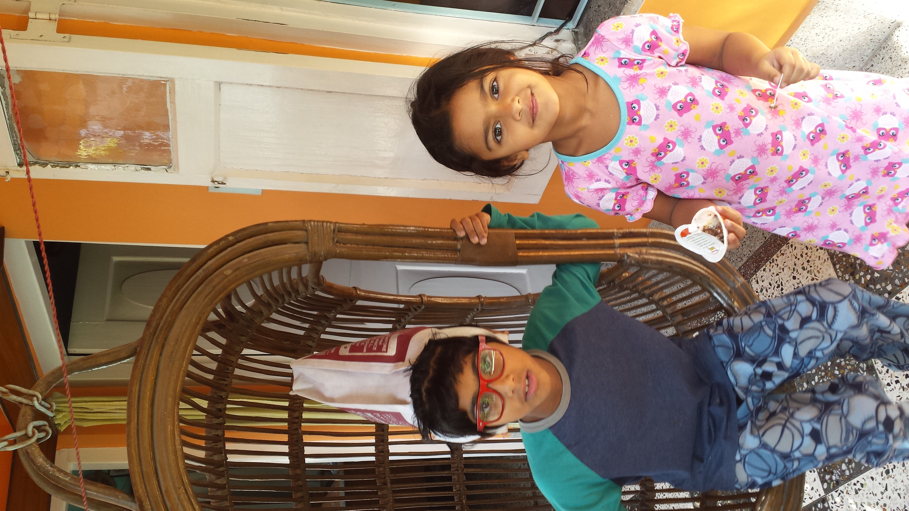
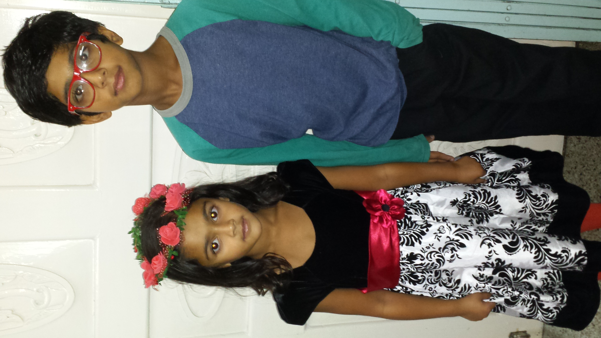
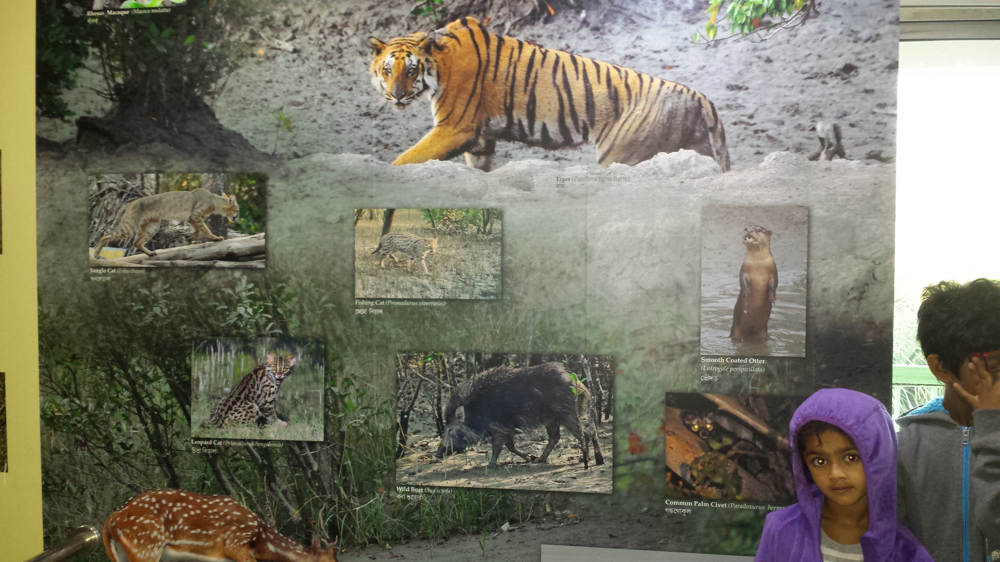
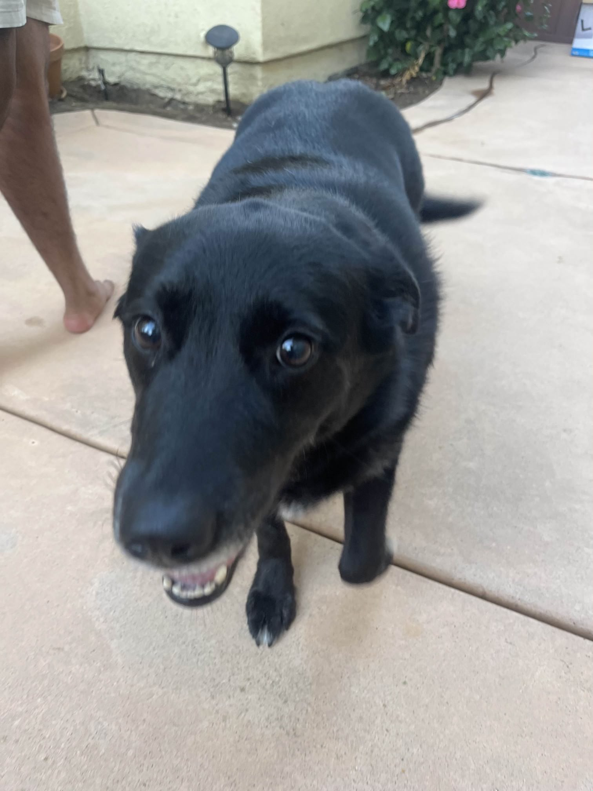

# 🌏 My Journey

    
    
    

Born in **India** 🇮🇳, moved to **San Diego, USA** 🇺🇸 in **2012**.

---

## 🎨 My Life

- 🏫 I went to elementary school at **Monterey Ridge Elementary School** in San Diego.
- 🏫 I attended **Oak Valley Middle School**.
- 🥊 I **box** and enjoy **weight lifting**🏋️.
- 🎨 I am learning to **oil paint**.
- 🐕 I enjoy walking my dog **Alo** every morning.
- 📺 I like to watch **MMA** on TV.
- 💻 I'm interested in **computers**, and I have built many of them myself.

---

## 👨‍👩‍👧‍👦 My Family

-🐶 I have a dog named **Alo**, and we love going on walks every morning.
-👨🏽‍👩🏽‍👧🏽‍👦🏽 I have a younger sister, and we often play video games together.
-⛺ We enjoy **camping**, 🎬 watching **movies**, ♟️ and playing **board games** as a family.

---

## 📸 Family Photo Gallery

    
    
    
    
    
    

