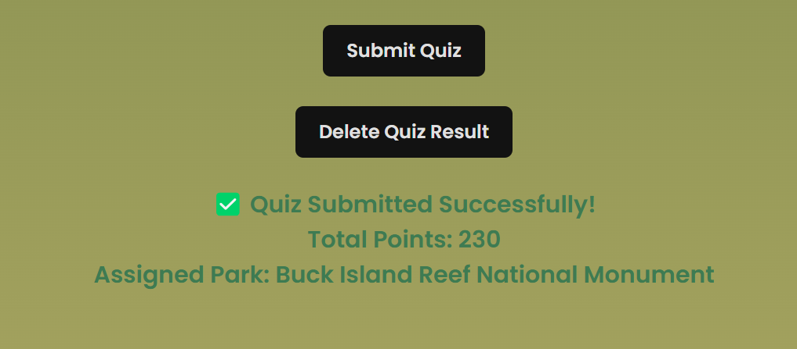
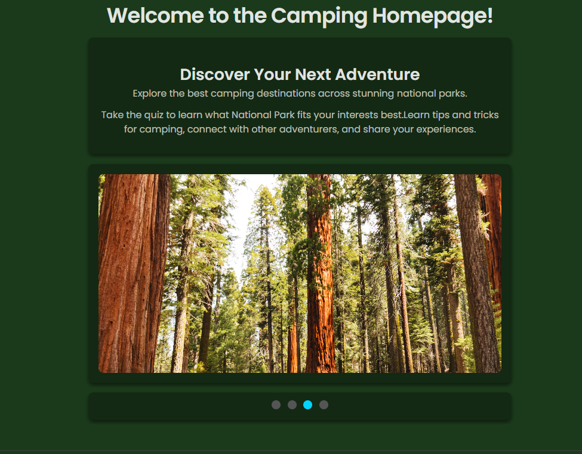
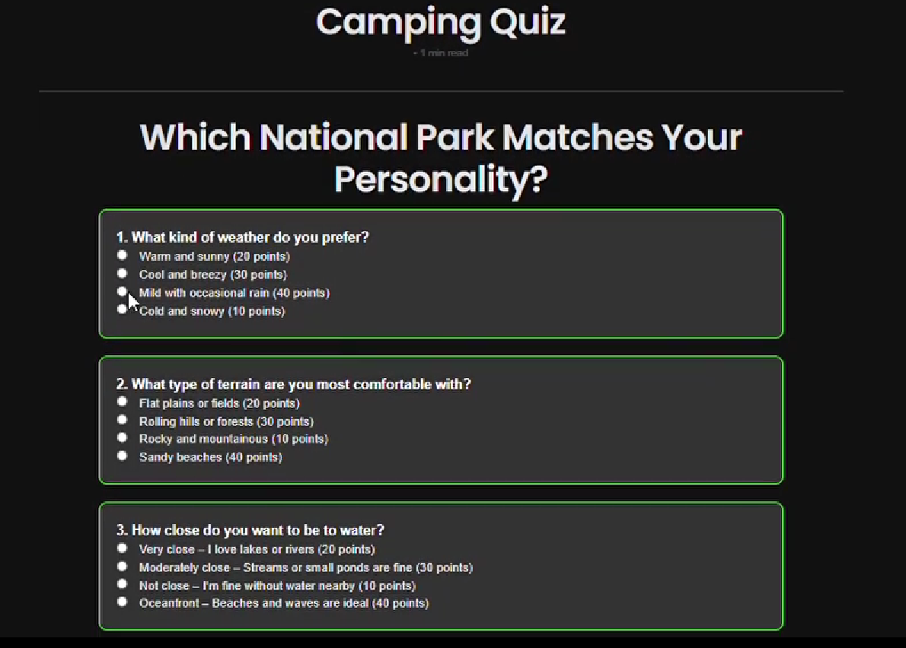
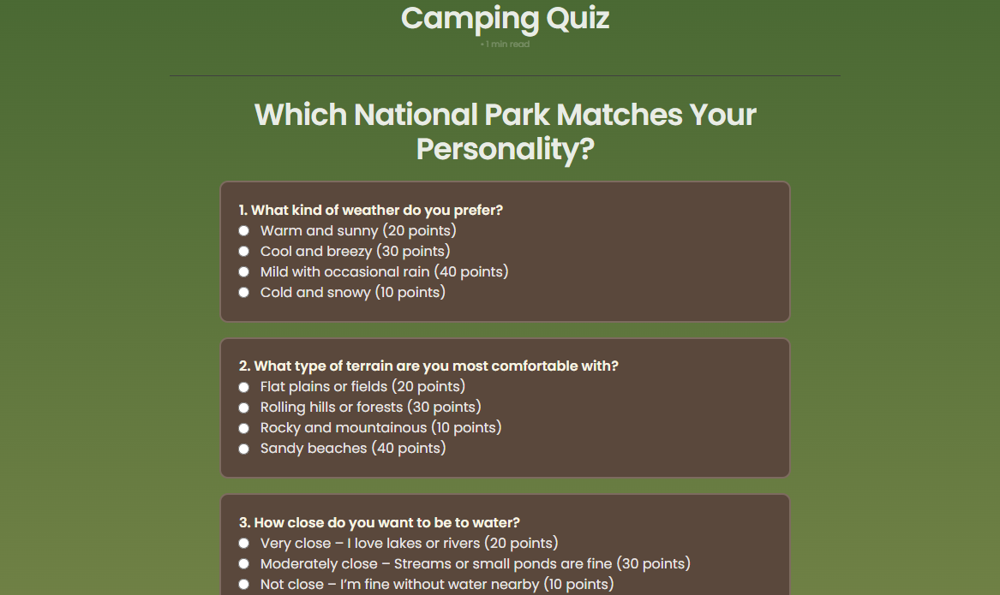

# Retrospective: Trimester 2

# **Retrospective: Trimester 2**

## **Table of Contents**
- [National Parks Personality Quiz](#1-national-parks-personality-quiz)
- [Planning and Personal Contribution Video](#2-planning-and-personal-contribution-video)
- [Camping Homepage](#3-camping-homepage)
- [Styling the Camping Side](#4-styling-the-camping-side)
- [Assistant Deployment Manager](#5-assistant-deployment-manager)
- [Demo: National Park Personality Quiz](#demo-national-park-personality-quiz)
- [CPT Requirements Table](#cpt-requirements-table)
- [N@TM Feedback](#natm-feedback)
- [My Feature Before](#my-feature-before)
- [Feedback Received](#feedback-received)
- [My Quiz After Taking Feedback](#my-quiz-after-taking-feedback)
- [My Time at N@TM](#my-time-at-natm)
- [AP CSA 2014 MCQ Review](#ap-csa-2014-mcq-review)
- [Looking Forward: My Future in CS & Machine Learning](#looking-forward-my-future-in-computer-science--machine-learning)
- [Self Grade](#self-grade)

---

## 1. National Parks Personality Quiz


The **National Parks Personality Quiz** helps users determine which national park best matches their interests. By answering a series of questions, users receive a personalized recommendation, making it an engaging and educational feature of our website.

## 2. Planning and Personal Contribution Video
<video width="640" height="360" controls>
    <source src="cspblog/frostbyte_vid.mp4" type="video/mp4">
</video>


The **Planning and Personal Contribution Video** was created to establish a clear vision for our project. My role was crucial in **editing and piecing together the video** to ensure it effectively communicated our goals and team contributions.

## 3. Camping Homepage



I developed the **Camping Homepage**, which serves as an introduction to the camping side of our website. This page features a **slideshow of national park images**, allowing users to **fullscreen images with a single click**, making it an interactive and visually appealing experience.

## 4. Styling the Camping Side

One of my major contributions was **styling the entire camping section** of our project. This directly addressed the criticism we received at **Night at the Museum**, where our project was called "gray." I improved the aesthetics to enhance user engagement and appeal.

## 5. Assistant Deployment Manager

As **Assistant Deployment Manager**, I played a key role in resolving **bugs and errors**, such as **CORS errors**, before my teammates contributed to the deployed site. My work ensured a **smooth deployment process** and minimized technical roadblocks for our team.

---
## Demo: National Park Personality Quiz
<video width="640" height="360" controls>
    <source src="cspblog/boi.mp4" type="video/mp4">
</video>

Click the image above to watch a **video demo** of the National Park Personality Quiz in action.

---

## CPT Requirements Table

| CPT Requirements              | Example Code Snippet |
|--------------------------------|---------------------------|
| Use of at least one list (or other collection type) to represent a collection of data that is stored and used to manage program complexity and help fulfill the program’s purpose | ```python sample_results = [ {"user_id": 1, "assigned_park": "Denali National Park"}, {"user_id": 2, "assigned_park": "Grand Canyon National Park"} ] ``` (From `initQuizResults` function in `QuizResult` model) |
| At least one procedure that contributes to the program’s intended purpose, where you have defined: the procedure’s name, the return type, one or more parameters | ```python def assign_national_park(self, total_points): ``` (From `_CRUD` class in `QuizAPI`) |
| Algorithm that includes sequencing, selection, and iteration that is in the body of the selected procedure | ```python if 0 <= total_points <= 130: return "Denali National Park" elif 140 <= total_points <= 170: return "Grand Canyon National Park" ``` (From `assign_national_park` function in `QuizAPI`) |
| Calls to your student-developed procedure | ```python assigned_park = self.assign_national_park(total_points) ``` (From `post` method in `QuizAPI`) |
| Instructions for output | ```javascript document.getElementById("result").innerText = `✅ Quiz Submitted Successfully! Total Points: ${total_points} Assigned Park: ${data.assigned_park || "Unknown"}`; ``` (From `submitQuiz()` function in frontend JavaScript) |

---

### Explanation of CPT Requirements in the Project

The **National Parks Personality Quiz** satisfies all **College Board CPT** requirements by utilizing key programming concepts:

1. **List/Data Collection**: The backend stores user quiz results in a database and uses lists (`sample_results`) for initialization.
2. **Procedures with Parameters**: The function `assign_national_park(total_points)` determines the appropriate national park based on a user's quiz score.
3. **Algorithm with Control Flow**: The function contains **sequencing, selection, and iteration** to evaluate user points and return a corresponding national park.
4. **Procedure Calls**: The `assign_national_park` function is called within the `post` method to assign a national park dynamically.
5. **Output Instructions**: The frontend JavaScript dynamically displays the quiz result on-screen, providing users with immediate feedback.

These components work together to create a **fully functional, interactive quiz** that assigns users a national park based on their preferences. The project meets **AP CSP CPT** standards while demonstrating real-world software development concepts.

---
## N@TM Feedback

**Night at the Museum (N@TM)** was an opportunity for us to showcase our project to a wider audience, including students, teachers, and visitors. Our team presented different aspects of our project, covering both technical and conceptual elements.

Each team member had a specific role:
- **Me (Demonstrator)** – Since I was sick, I provided the demonstration while Abby described the features.
- **Risha** – Spoke about **deployment**, explaining how our project was hosted and maintained.
- **Elliot** – Covered **team challenges**, discussing obstacles we faced and how we overcame them.
- **Abby** – Highlighted our **features** as I showcased them in real-time.
- **Shriya** – Answered **general audience questions** about our project and process.
- **Ava** – Was absent due to a trip.

The event provided valuable feedback that helped us refine our project further.


## My Feature Before

Before receiving feedback at **Night at the Museum (N@TM),** my quiz had a plain black background with minimal styling. The design was functional but lacked the aesthetic appeal necessary to match the **National Park** theme.



---

## Feedback Received

At N@TM, I received constructive feedback from multiple attendees, primarily focused on **styling improvements** and **user experience enhancements**. Some key takeaways included:

### **1. Improve Styling & Make It More National Park Themed**
> *"Improve the styling from plain black to something more national park themed."*  
> — **Arnav Mittal**

> *"I think the UI and UX could be greatly improved upon, as at the moment it seems a bit plain and lacks aesthetic relevant to your topic."*  
> — **Mihir**

### **2. Expand Color Variety & Improve Visuals**
> *"I would like if there was a wider variety of colors on the website."*  
> — **Xavier Thompson**

> *"Maybe more colorful! I think you can open up the creativity on some pages to make the page pop more."*  
> — **Trevor Huang**

### **3. Improve Frontend Design & Font Choices**
> *"Improve styling on front-end page, black background is a bit boring."*  
> — **Ansh Kumar**

> *"Maybe add better fonts/backend UI design."*  
> — **Yash Parikh**
---

## My Quiz After Taking Feedback

After reflecting on the feedback, I implemented **several key improvements** to enhance the quiz experience:

- **Updated the styling** to reflect **earthy tones, green palettes, and natural textures** that align with the **National Park** theme.
- **Refined UI elements** by adjusting fonts and layouts to **improve readability** and user engagement.
- **Expanded color variety**, replacing the **plain black background** with a more engaging visual aesthetic.
- **Optimized responsiveness** to ensure the quiz looks great on **various screen sizes and devices**.

These changes helped make the quiz **more visually appealing, intuitive, and aligned with the overall theme** of the project.



---
## My Time at N@TM

At **Night at the Museum (N@TM),** I had the chance to explore several incredible projects created by other students. Each project showcased unique ideas and technical implementations, and I provided constructive feedback to help improve their designs and usability.

In addition to viewing these projects, I also conducted **interviews** with some of the creators. In these interviews, I asked:
- **Their name and project name** as an introduction.
- **The purpose of their project** to understand their vision and goals.
- **The biggest challenges their team faced** as they worked on it, as a way to see how different students at various levels struggled through their **computer science journey** and compare their experiences to my own.

---

### **Study Buddy – A Notecard Study App**
One project I explored was **Study Buddy**, an app designed for creating and searching through study note cards. The app was useful for students, but I noticed that there was **no way to organize the notecards by topic or category**. I shared this feedback with the team, suggesting an **organizational feature** to improve user experience.

---

### **Revvit – A Social Media Site for Cars**
Another standout project was **Revvit**, a **social media platform for car enthusiasts**. The site featured:
- **Instagram-like posting** with user-generated content.
- **A commenting system** for discussions.
- **Dedicated sections** for showcasing car events and shows.

I really liked the site’s features, but I noticed that **many functionalities were spread across separate pages**, making navigation more complex than necessary. I suggested that the **UI be redesigned similar to Instagram**, with a **main feed containing everything** and the ability to click into specific sections from there.


---

### **Aidan Lau’s Educational Game**
I also checked out **Aidan Lau’s educational game**, which had **engaging animations** and a **variety of question types**. However, I recommended:
- **A more uniform art style** to create visual consistency.
- **Additional visually interesting elements** to make the questions more appealing.

During my interview with **Aidan Lau**, I asked him about his **project's purpose**, his **biggest challenges**, and how his team tackled obstacles during development.

🎧 **Interview with Aidan Lau:**  
🔊 [Audio File](./cspblog/Aidanluzz.mp3)

---

### **Daksha’s Whiteboard Drawing App**
Finally, I visited **Daksha Gowda’s project**, a **collaborative whiteboard drawing app**. I found it to be a cool and practical tool, with potential applications for brainstorming, design work, and tutoring.

In my **interview with Daksha**, I asked similar questions to **understand the motivation behind the project** and the **challenges faced** while developing it.

🎧 **Interview with Daksha Gowda:**  
🔊 [Audio File](./cspblog/Daksha.mp3)

---

[](../navigation/journy.md)

## **AP CSA 2014 MCQ Review 🖥️**

I recently completed the **AP CSA 2014 MCQ**, **without outside help**, and scored **33/40**.  
While I did well overall, there were a few concepts I struggled with, particularly:  
- **Loop conditions and output prediction**  
- **Understanding inheritance and method overriding**  
- **Array manipulation and iteration logic**  
- **For-each loop behavior and method calls**  
- **Mathematical computation in loops**  

  

Here’s a breakdown of the **7 questions I got wrong**, with **detailed corrections** for each!  

---

### **📌 Mistake #1: Array Iteration & Conditional Printing**
#### ❌ **My Answer:** `E (725330)`  
#### ✅ **Correct Answer:** `B (072533)`

#### **What Went Wrong?**
- The loop **iterates through the array** while checking if `arr[k] > arr[k+1]`.
- When true, it prints `k` and `arr[k]`.
- **Correct output** prints only when an element is **greater than its next neighbor**.

#### **Correct Approach:**
- **Manually trace each iteration** to identify when the condition is met.
- Always check **index boundaries** to avoid skipping key comparisons.

---

### **📌 Mistake #2: For-Each Loop & Method Calls**
#### ❌ **My Answer:** `B (myVehicles[v].getMileage())`  
#### ✅ **Correct Answer:** `E (v.getMileage())`

#### **What Went Wrong?**
- `myVehicles` is an `ArrayList<Vehicle>`, so `v` in the for-each loop **already represents a `Vehicle` instance**.
- The method should be called **directly on `v`**, not on an indexed value.

#### **Correct Approach:**
- **For-each loops don’t use indexing**; they iterate over elements directly.
- The **correct syntax** is `v.getMileage();`, not `myVehicles[v].getMileage();`.

---

### **📌 Mistake #3: Changing Object Attributes**
#### ❌ **My Answer:** `C (student.getName("Tom"))`  
#### ✅ **Correct Answer:** `D (student.setName("Tom"))`

#### **What Went Wrong?**
- `getName()` **retrieves** the value, it **does not modify it**.
- `setName(String name)` is the **correct mutator method**.

#### **Correct Approach:**
- **Use accessor methods (`getName()`) to retrieve data**.
- **Use mutator methods (`setName()`) to modify data**.

---

### **📌 Mistake #4: Inheritance & Method Overriding**
#### ❌ **My Answer:** `D (Line 6 ambiguity issue)`  
#### ✅ **Correct Answer:** `B (Line 4 - Book variables only call Book methods)`

#### **What Went Wrong?**
- `books[]` is declared as an **array of `Book` objects**.
- Even though `books[0]` is an `AudioBook`, Java treats it as a **`Book` reference**.
- You **cannot call `pagesPerMinute()`** because it is **not defined in `Book`**.

#### **Correct Approach:**
- **Objects are referenced by their declared type**.
- **If a method is only in a subclass (`AudioBook`), you cannot call it through a `Book` reference**.

---

### **📌 Mistake #5: 2D Array Population**
#### ❌ **My Answer:** `B (4)`  
#### ✅ **Correct Answer:** `A (3)`

#### **What Went Wrong?**
- The loop fills a **3×3 2D array** column by column.
- `newArray[0][2]` is assigned `3`, not `4`.

#### **Correct Approach:**
- **Recognize that row increments first, then resets when full**.
- **Manually track how values are inserted** into each row.

---

### **📌 Mistake #6: Array Mutation in a Loop**
#### ❌ **My Answer:** `D (734118)`  
#### ✅ **Correct Answer:** `B (573411)`

#### **What Went Wrong?**
- `mystery()` modifies the array in **place**, not a copy.
- Each iteration **updates the next element** based on the current sum.

#### **Correct Approach:**
- **Write out array changes step-by-step**.
- **Remember Java arrays are passed by reference**.

---

### **📌 Mistake #7: Loop Multiplication Logic**
#### ❌ **My Answer:** `D (2^k)`  
#### ✅ **Correct Answer:** `C (n^k)`

#### **What Went Wrong?**
- The loop multiplies `answer *= n;` **`k` times**, effectively computing **n^k**.
- I mistakenly thought it was `2^k`, but `n` isn’t always `2`.

#### **Correct Approach:**
- **Recognize that repeated multiplication is exponentiation**.
- **Carefully analyze loop structure to identify patterns**.

---

### **Final Thoughts 💡**
Overall, this was a **great learning experience**! 🚀  
- **Loop tracing is crucial** for understanding array outputs.
- **Inheritance rules matter** when calling subclass methods.
- **Mathematical computations in loops** require close attention to **iteration behavior**.

By **reviewing mistakes systematically**, I now have a **better understanding** of these concepts and **will improve in future practice tests**.  

---

## **Looking Forward: My Future in Computer Science & Machine Learning 🚀**

As I continue my **computer science journey**, my goal is to **major in CS** with a focus on **machine learning**. One of the most exciting aspects of ML is its ability to **interpret and analyze vast amounts of data**, leading to smarter, more efficient systems.

### **Exploring Machine Learning Concepts 🤖**
Recently, I’ve been diving into **image segmentation** and **sensor comparisons** to better understand how machines perceive their environments.

- **Image Segmentation** 🖼️: This technique breaks down an image into multiple segments to help a model identify objects more effectively. It’s widely used in medical imaging, self-driving cars, and even video analysis.
  
- **LiDAR vs. RGB vs. Event Cameras** 📡🎥:  
  - **LiDAR (Light Detection and Ranging):** Uses laser pulses to create a 3D map of an environment—great for depth perception.  
  - **RGB Cameras:** Capture standard color images but struggle with depth information.  
  - **Event Cameras:** Only record pixel changes over time, making them **extremely fast** and **low latency**—potentially better for real-time object detection.

I have been researching how these technologies compare, and I’ve found **online datasets** to experiment with **real-world ML applications**.

---

### **Growth as a Computer Science Student 📈**
Reflecting on my journey, I’ve seen major growth in my **technical and problem-solving skills**. Going into **Trimester 2**, I had **zero experience** with **backend development**, but now I feel **comfortable working with APIs and databases**.

One of my biggest learning experiences was **deployment**—it was a huge challenge that required deep troubleshooting. While I **understand it better now**, I still have a long way to go in fully grasping **server management, CI/CD pipelines, and cloud hosting**.

---

### **Soft Skills & Leadership Development 🏆**
Beyond coding, this trimester helped me improve my **soft skills**, particularly in leadership and team management.  

- **Assistant Scrum Master** ⚡: I learned to **manage my half of the group**, making sure tasks were completed efficiently.  
- **Kanban Board Documentation** 📝: Keeping track of work in **an organized and structured way** helped improve our team's workflow.  
- **Communication & Problem-Solving** 🗣️: I had to **balance technical work and leadership**, ensuring that everyone was on the same page.

---

### **Final Thoughts 🎯**
I’ve come a long way this trimester—from struggling with backend development to confidently working with **databases, APIs, and server-side logic**. While **deployment still remains a challenge**, I’m excited to **continue learning and refining my skills**. 

Looking ahead, I plan to:
✅ Continue experimenting with **ML models for sensor fusion**  
✅ Improve my understanding of **software deployment & automation**  
✅ Seek **internships** to apply my knowledge in real-world settings  
✅ Keep refining my **teamwork and leadership abilities**  

## **Self Grade**

| **Requirements**                         | **Grade** | **Reasoning** |
|------------------------------------------|---------|-----------------------------------------------------------------------------------------------------------------------------------------------------|
| **5 Things (5)**                         | **5**   | Over the trimester, I took on multiple roles, including API development, frontend styling, and debugging deployment issues. I actively contributed to feature development, problem-solving, and improving our project based on N@TM feedback. |
| **Full Stack Project Demo (2)**          | **2**   | The full-stack demo showcased how my quiz feature works efficiently from the user perspective. I took feedback from N@TM and analyzed how our project could be enhanced further. |
| **Project Feature Blog Write-Up (1)**    | **0.8** | While I successfully documented my feature and included CPT requirements, I can improve on articulating technical details more smoothly in future explanations. |
| **MCQ (1)**                              | **1**   | I completed the AP CSA MCQ section and corrected what I got wrong. While I still have areas to work on, I now have a better understanding of what topics to focus on. |
| **Ability to Impress (1)**               | **0.5** | I demonstrated my growth by taking on leadership tasks, improving my backend skills, and exploring ML topics beyond the class. My retrospective covers my challenges, progress, and next steps, showing my commitment to continuous learning. |

**Total: 9.3/10**

<script src="https://utteranc.es/client.js"
        repo="Mom5MoreMins/aranya_student_2025"
        issue-term="pathname"
        theme="github-dark"
        crossorigin="anonymous"
        async>
</script>
