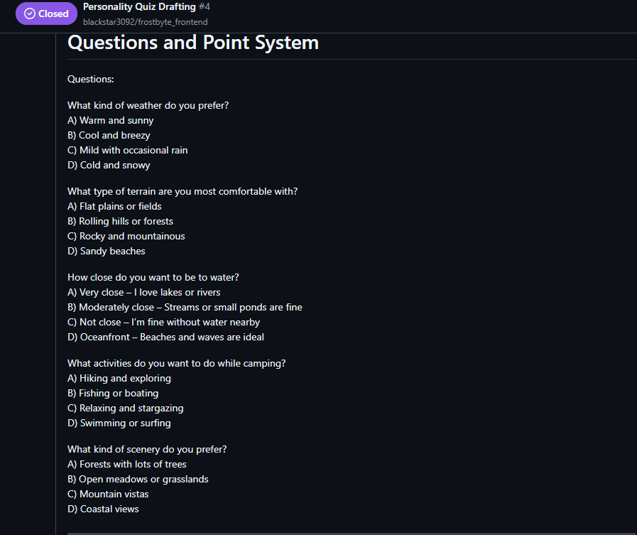
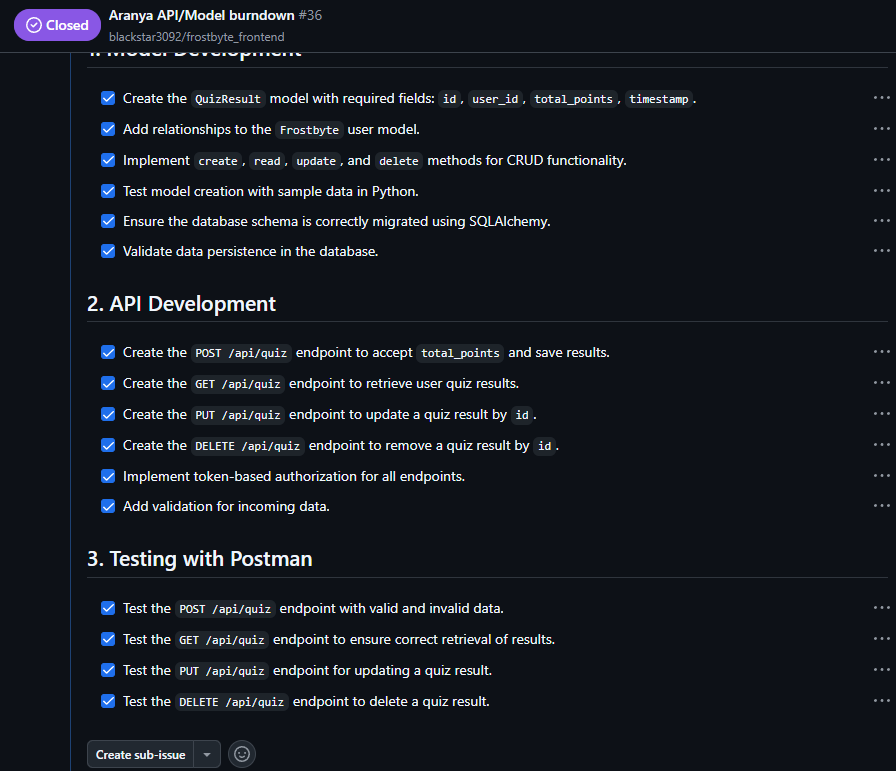

## **Building the National Park Personality Quiz 🏞️**

### **Planning the Quiz 📝**
When designing the **National Park Personality Quiz**, I needed a way to **categorize user responses** and assign them to a national park based on their answers. The idea was simple:  
- Each **question** has multiple-choice answers, each **worth a different number of points**.  
- The **total points** determine the **best-fit national park** for the user.  
- The **backend** would process the responses and return an **assigned national park**.  

This allowed for **efficient data management** and **scalability** in case we wanted to add more parks later!  

---

### **Tracking Progress with a Burndown Menu 📊**
To stay on track with **frontend-backend integration**, I created a **burndown menu** 🏗️ to keep track of:

This **agile approach** made sure I stayed **organized and efficient** while developing the quiz, as well as allowing my teammates to keep up with my progress!  

---

### **Breaking Down the Code 🖥️**
Now, let’s talk about how this project meets **CPT requirements** using key programming concepts!

#### **📌 Using a List to Manage Data**
To store and track **quiz results**, I used a **list-like collection** in the database to handle users and their assigned parks:
~~~python
sample_results = [
    {"user_id": 1, "assigned_park": "Denali National Park"},
    {"user_id": 2, "assigned_park": "Grand Canyon National Park"}
]
~~~
This stores and retrieves quiz data efficiently, meeting the requirement for **data collection management**.

---

#### **📌 Using a Procedure with Parameters**
A key function in the backend API is `assign_national_park()`, which takes a total score as input and returns an assigned park:
~~~python
def assign_national_park(self, total_points):
    if 0 <= total_points <= 130:
        return "Denali National Park"
    elif 140 <= total_points <= 170:
        return "Grand Canyon National Park"
    elif 180 <= total_points <= 220:
        return "Redwood National Park"
    else:
        return "Unknown Park"
~~~
- **Defines a procedure name**  
- **Uses a parameter (`total_points`)**  
- **Returns a value (assigned park)**  

This function simplifies complexity by handling all park assignments in one place.

---

#### **📌 Implementing an Algorithm with Sequencing, Selection, and Iteration**
The quiz logic follows structured control flow using:
- **Sequencing** (executing steps in order)
- **Selection** (if-elif conditions to assign parks)
- **Iteration** (looping through stored results to retrieve user data)

Example:
~~~python
if 0 <= total_points <= 130:
    return "Denali National Park"
elif 140 <= total_points <= 170:
    return "Grand Canyon National Park"
~~~
This ensures a clear decision-making process in the body of the procedure.

---

#### **📌 Calling a Student-Developed Procedure**
To connect frontend and backend, the function is called when a user submits their quiz:
~~~python
assigned_park = self.assign_national_park(total_points)
~~~
This triggers the algorithm and returns the final park assignment.

---

#### **📌 Instructions for Output**
After API processing, the frontend dynamically updates the result:
~~~javascript
document.getElementById("result").innerText = 
    `✅ Quiz Submitted Successfully! Total Points: ${total_points} Assigned Park: ${data.assigned_park || "Unknown"}`;
~~~
This meets the requirement for output instructions and ensures the user gets immediate feedback.

---

### **Final Thoughts 🎯**
Developing this quiz required planning, problem-solving, and iteration to create a fully functional full-stack project. Using lists, procedures, algorithms, and output handling, I built an interactive and engaging quiz that assigns users to a national park that fits their personality.

N@TM gave us great feedback, and I improved styling, UI flow, and user engagement. This project challenged me to think about user experience, data processing, and front-end/back-end interaction—valuable skills I’ll carry forward!

