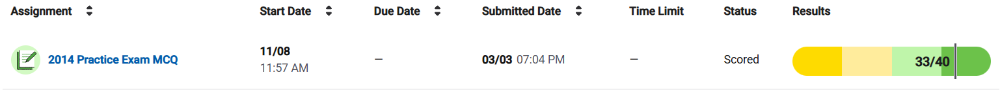

## **AP CSA 2014 MCQ Review 🖥️**

I recently completed the **AP CSA 2014 MCQ**, **without outside help**, and scored **33/40**.  
While I did well overall, there were a few concepts I struggled with, particularly:  
- **Loop conditions and output prediction**  
- **Understanding inheritance and method overriding**  
- **Array manipulation and iteration logic**  
- **For-each loop behavior and method calls**  
- **Mathematical computation in loops**  

  

Here’s a breakdown of the **7 questions I got wrong**, with **detailed corrections** for each!  

---

### **📌 Mistake #1: Array Iteration & Conditional Printing**
#### ❌ **My Answer:** `E (725330)`  
#### ✅ **Correct Answer:** `B (072533)`

#### **What Went Wrong?**
- The loop **iterates through the array** while checking if `arr[k] > arr[k+1]`.
- When true, it prints `k` and `arr[k]`.
- **Correct output** prints only when an element is **greater than its next neighbor**.

#### **Correct Approach:**
- **Manually trace each iteration** to identify when the condition is met.
- Always check **index boundaries** to avoid skipping key comparisons.

---

### **📌 Mistake #2: For-Each Loop & Method Calls**
#### ❌ **My Answer:** `B (myVehicles[v].getMileage())`  
#### ✅ **Correct Answer:** `E (v.getMileage())`

#### **What Went Wrong?**
- `myVehicles` is an `ArrayList<Vehicle>`, so `v` in the for-each loop **already represents a `Vehicle` instance**.
- The method should be called **directly on `v`**, not on an indexed value.

#### **Correct Approach:**
- **For-each loops don’t use indexing**; they iterate over elements directly.
- The **correct syntax** is `v.getMileage();`, not `myVehicles[v].getMileage();`.

---

### **📌 Mistake #3: Changing Object Attributes**
#### ❌ **My Answer:** `C (student.getName("Tom"))`  
#### ✅ **Correct Answer:** `D (student.setName("Tom"))`

#### **What Went Wrong?**
- `getName()` **retrieves** the value, it **does not modify it**.
- `setName(String name)` is the **correct mutator method**.

#### **Correct Approach:**
- **Use accessor methods (`getName()`) to retrieve data**.
- **Use mutator methods (`setName()`) to modify data**.

---

### **📌 Mistake #4: Inheritance & Method Overriding**
#### ❌ **My Answer:** `D (Line 6 ambiguity issue)`  
#### ✅ **Correct Answer:** `B (Line 4 - Book variables only call Book methods)`

#### **What Went Wrong?**
- `books[]` is declared as an **array of `Book` objects**.
- Even though `books[0]` is an `AudioBook`, Java treats it as a **`Book` reference**.
- You **cannot call `pagesPerMinute()`** because it is **not defined in `Book`**.

#### **Correct Approach:**
- **Objects are referenced by their declared type**.
- **If a method is only in a subclass (`AudioBook`), you cannot call it through a `Book` reference**.

---

### **📌 Mistake #5: 2D Array Population**
#### ❌ **My Answer:** `B (4)`  
#### ✅ **Correct Answer:** `A (3)`

#### **What Went Wrong?**
- The loop fills a **3×3 2D array** column by column.
- `newArray[0][2]` is assigned `3`, not `4`.

#### **Correct Approach:**
- **Recognize that row increments first, then resets when full**.
- **Manually track how values are inserted** into each row.

---

### **📌 Mistake #6: Array Mutation in a Loop**
#### ❌ **My Answer:** `D (734118)`  
#### ✅ **Correct Answer:** `B (573411)`

#### **What Went Wrong?**
- `mystery()` modifies the array in **place**, not a copy.
- Each iteration **updates the next element** based on the current sum.

#### **Correct Approach:**
- **Write out array changes step-by-step**.
- **Remember Java arrays are passed by reference**.

---

### **📌 Mistake #7: Loop Multiplication Logic**
#### ❌ **My Answer:** `D (2^k)`  
#### ✅ **Correct Answer:** `C (n^k)`

#### **What Went Wrong?**
- The loop multiplies `answer *= n;` **`k` times**, effectively computing **n^k**.
- I mistakenly thought it was `2^k`, but `n` isn’t always `2`.

#### **Correct Approach:**
- **Recognize that repeated multiplication is exponentiation**.
- **Carefully analyze loop structure to identify patterns**.

---

### **Final Thoughts 💡**
Overall, this was a **great learning experience**! 🚀  
- **Loop tracing is crucial** for understanding array outputs.
- **Inheritance rules matter** when calling subclass methods.
- **Mathematical computations in loops** require close attention to **iteration behavior**.

By **reviewing mistakes systematically**, I now have a **better understanding** of these concepts and **will improve in future practice tests**.  

