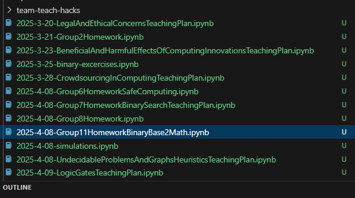
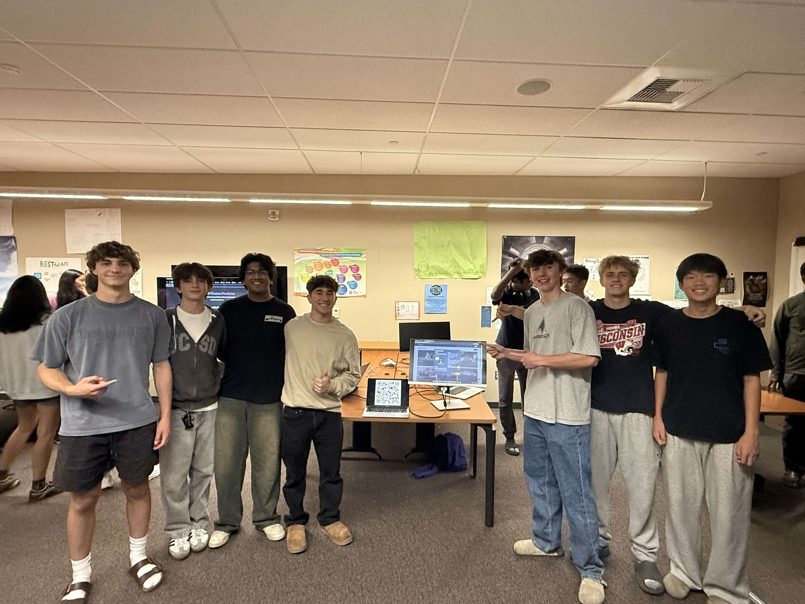
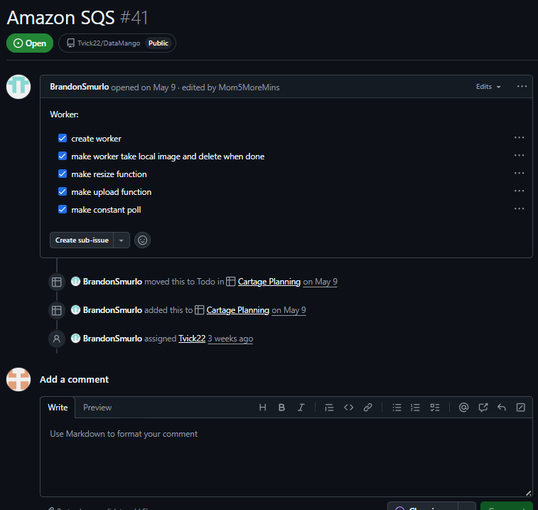
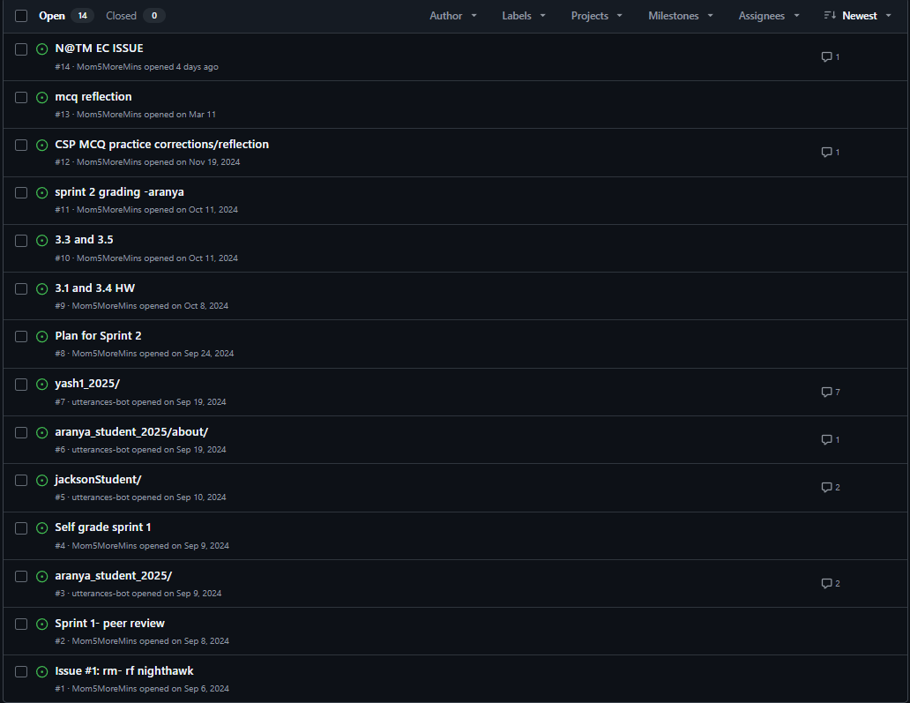

## Overview of Projects
- **ShotSpot** – a photography‐sharing app built for our school’s photography class.  
  - **Communities**: create or join niche groups to share and explore specific photography styles.  
  - **Categorized Posting**: tag each upload (e.g., “landscape”) so you can filter your feed by category.  
  - **Robust Upload Workflow**: a backend worker polls for new upload jobs, resizes images, and pushes them to AWS S3—keeping storage efficient and users informed of their upload status.  

## My Unique Qualities
- **Backend Engineering & Workflow Optimization**  
  Designed and built the upload worker that polls for jobs, resizes images, and uploads to AWS S3 for optimal performance and real-time status updates.  
- **Feedback-Driven Development**  
  Implemented the `resize_image` function directly in response to Mr. Mort’s feedback ([see commit](https://github.com/Tvick22/ShotSpot-Backend/commit/aea36b72322328fc423b83c3fb17e65491f0ef6c)).  
- **End-to-End Contribution**  
  Developed both the backend worker and the frontend upload page to ensure a seamless user experience from file selection through completion.  
- **Collaborative Problem-Solving**  
  Worked closely with my team to integrate community and category features, also to make it work in tandum with other image features such as the profile picture upload.

## HW Proof

- [HW Proof Link 1]()  
- [HW Proof Link 2]()

🏆 Certificates (Foundation)
- **Environment Setup Fundamentals (2025)** – configured WSL, VS Code, and Python virtual environments.  
- **HTML & CSS Basics (2024)** – built responsive layouts with Flexbox and Grid.  
- **First Webpage Development (2025)** – created your inaugural webpage using HTML and CSS.  
- **Frontend-Backend Integration (2025)** – established seamless communication between client and server.  
- **AWS Deployment Fundamentals (2025)** – deployed full-stack applications on AWS infrastructure.

🎖️ Tokens (Unique Contributions)
- **Upload Worker** – polls, resizes images, and uploads to S3 with live status updates.   
- **SQS-Based Image Uploads** – implemented an AWS SQS queue to coordinate and scale image upload tasks.  
- **Async Upload Worker** – built a worker service that polls the SQS queue, processes images asynchronously, and updates client status.

## N@TM PRESENTATION
On June 5, I showcased ShotSpot at the Night at the Museum (N@TM) event. It was a great opportunity to present the work I had built throughout the year and to reflect on how far both I and my classmates had come. I shared how ShotSpot, a collaborative social platform for photographers, was developed using skills I learned in web development and Open Coding Society. Trevor and I went over our backend documentation with parents who worked in software development and were curious about how we manage our services and architecture. Engaging with peers and visitors at the event made the experience both insightful and rewarding.

## Personal Contributions

**Commits**  
I consistently committed to our backend more so than our frontend, focusing on integrating AWS services, improving reliability, and refining our image upload system.

**Issues**  
I kept issues both personally and also on our shared Kanban board, where I detailed progress on the SQS worker, including tasks like queue setup, polling logic, and async uploads to S3.

  

 ## Resume  
🔗 [View My Resume](https://docs.google.com/document/d/1rjRZZRptBc26ZEOCYlAkTA7NYrlvtRhjLNShEbvu4Mk/edit?usp=sharing)

## Contact Card (+ LinkedIn Post)  
🔗 [View My vCard]()

---

## Certificates
- **JavaScript Proficiency Certificate**  
- **Responsive Web Design Certificate**  
- **GitHub Collaboration Certificate**

---

## Future Plans for ShotSpot  
- Pitch the platform to the school’s Photography class to get real user feedback  
- Share the GitHub and documentation with next year’s CSP students as a learning base  
- Turn ShotSpot into a networking tool for high school creatives and college photographers  
- Use it as part of an online portfolio to support internship applications  

---

## How I Plan to Implement in College (Data Science)  
Although I plan to pursue a data science-related field in college, ShotSpot has already taught me essential skills—especially in Python—that directly connect to my future goals. Building backend workflows, writing image-processing functions, and working with cloud storage has helped me understand key concepts that are critical in machine learning. I'm currently writing a research paper on **image segmentation**, and this project laid the groundwork for that by teaching me how to handle image data programmatically and efficiently.

---

## Internship Relevance & Takeaways  
I’m currently interning at **Karr Company UK**, where I’m working on building an MVP and developing a full-stack product. My experience with ShotSpot made it easier to understand and apply **Agile methodology**, which is the foundation of how the team at Karr operates.  

This internship builds directly on the foundation I laid duri
 
